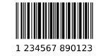

python-barcode
==============

This library provides a simple way to create barcodes using only the
Python standard lib. The barcodes are created as SVG objects.

Please report any bugs at https://github.com/WhyNotHugo/python-barcode/issues

Requirements
------------

- Setuptools/distribute for installation.
- Python 3.5 or above
- Program to open SVG objects (your browser should do it)
- Optional: PIL to render barcodes as images (PNG, JPG, ...)

Installation
------------

The best way is to use pip: ``pip install python-barcode``.

You can also install manually by downloading the tarball, extracting it, and
running ``python setup.py install``.

Provided Barcodes
-----------------

* EAN-8
* EAN-13
* EAN-14
* UPC-A
* JAN
* ISBN-10
* ISBN-13
* ISSN
* Code 39
* Code 128
* PZN

Todo
----

- Add documentation
- Add more codes

Usage
-----

Interactive::

    >>> import barcode
    >>> barcode.PROVIDED_BARCODES
    [u'code39', u'code128', u'ean', u'ean13', u'ean8', u'gs1', u'gtin',
     u'isbn', u'isbn10', u'isbn13', u'issn', u'jan', u'pzn', u'upc', u'upca']
    >>> EAN = barcode.get_barcode_class('ean13')
    >>> EAN
    <class 'barcode.ean.EuropeanArticleNumber13'>
    >>> ean = EAN(u'5901234123457')
    >>> ean
    <barcode.ean.EuropeanArticleNumber13 object at 0x00BE98F0>
    >>> fullname = ean.save('ean13_barcode')
    >>> fullname
    u'ean13_barcode.svg'
    # Example with PNG
    >>> from barcode.writer import ImageWriter
    >>> ean = EAN(u'5901234123457', writer=ImageWriter())
    >>> fullname = ean.save('ean13_barcode')
    u'ean13_barcode.png'
    # New in v0.4.2
    >>> from StringIO import StringIO
    >>> fp = StringIO()
    >>> ean.write(fp)
    # or
    >>> f = open('/my/new/file', 'wb')
    >>> ean.write(f) # PIL (ImageWriter) produces RAW format here
    # New in v0.5.0
    >>> from barcode import generate
    >>> name = generate('EAN13', u'5901234123457', output='barcode_svg')
    >>> name
    u'barcode_svg.svg'
    # with file like object
    >>> fp = StringIO()
    >>> generate('EAN13', u'5901234123457', writer=ImageWriter(), output=fp)
    >>>

Now open ean13_barcode.[svg|png] in a graphic app or simply in your browser
and see the created barcode. That's it.

Commandline::

    $ pybarcode create "My Text" outfile
    New barcode saved as outfile.svg.
    $ pybarcode create -t png "My Text" outfile
    New barcode saved as outfile.png.

    Try `pybarcode -h` for help.

Changelog
---------

v0.8.3
~~~~~~

* Fix pushing of releases to GitHub.

v0.8.2
~~~~~~

* Fix crashes when attempting to use the CLI app.
* Properly include version numbers in SVG comments.

v0.8.1
~~~~~~
* Improve README rendering, and point to this fork's location (the outdated
  README on PyPI was causing some confusion).

v0.8.0
~~~~~~
* First release under the name ``python-barcode``.

Previous Changelog
------------------

This project is a fork of pyBarcode, which, apparently, is no longer
maintained. v0.8.0 is our first release, and is the latest ``master`` from that
parent project.

v0.8
~~~~
* Code 128 added.
* Data for charsets and bars moved to subpackage barcode.charsets.
* Merged in some improvements.

v0.7
~~~~
* Fixed some issues with fontsize and fontalignment.
* Added Python 3 support. It's not well tested yet, but the tests run without
  errors with Python 3.3. Commandline script added.

v0.6
~~~~
* Changed save and write methods to take the options as a dict not as keyword
  arguments (fix this in your code). Added option to left align the text under
  the barcode. Fixed bug with EAN13 generation.

v0.5.0
~~~~~~
* Added new generate function to do all generation in one step.
* Moved writer from a subpackage to a module (this breaks some existing code).
  UPC is now rendered as real UPC, not as EAN13 with the leading "0".

v0.4.3
~~~~~~
* Fixed bug in new write method (related to PIL) and updated docs.

v0.4.2
~~~~~~
* Added write method to support file like objects as target.

v0.4.1
~~~~~~
* Bugfix release. Removed redundancy in input validation.
* EAN8 was broken. It now works as expected.

v0.4
~~~~
* Removed \*\*options from writers __init__ method. These options never had
  effect. They were always overwritten by default_options.
* New config option available: text_distance (the distance between barcode and
  text).

v0.4b2
~~~~~~
* Basic documentation included. The barcode object now has a new attribute
  called `raw` to have the rendered output without saving to disk.

v0.4b1
~~~~~~
* Support for rendering barcodes as images is implemented.  PIL is required to
  use it.

v0.3
~~~~
* Compression for SVG output now works.

v0.3b1
~~~~~~
* Writer API has changed for simple adding new (own) writers.
* SVG output is now generated with xml.dom module instead of stringformatting
  (makes it more robust).

v0.2.1
~~~~~~
* API of render changed. Now render takes keyword arguments instead of a dict.

v0.2
~~~~
* More tests added.

v0.1
~~~~
* First release.
